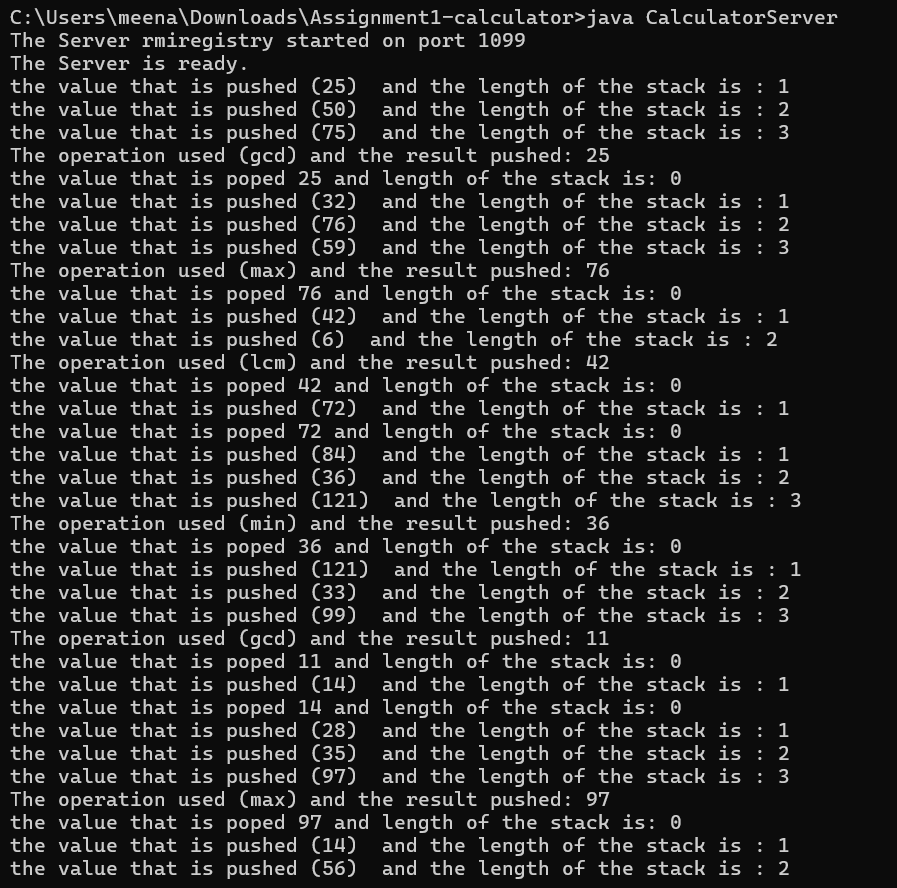
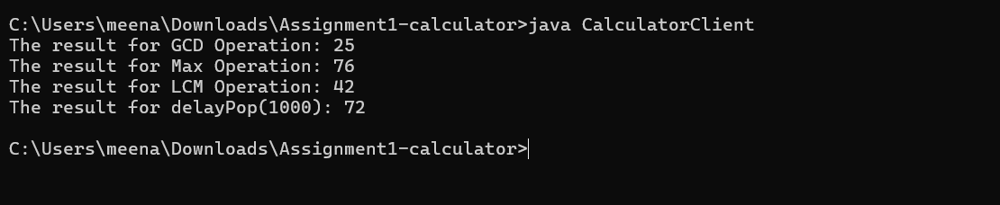
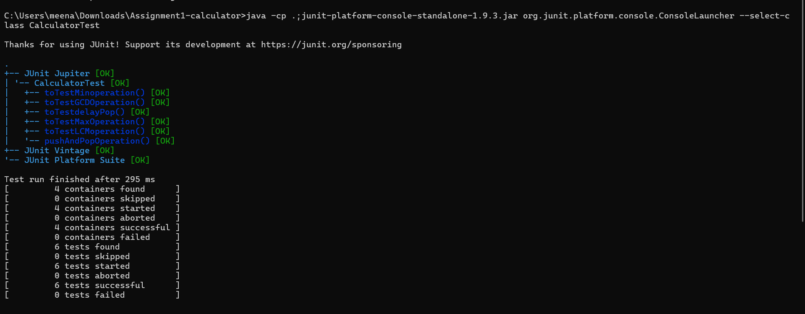
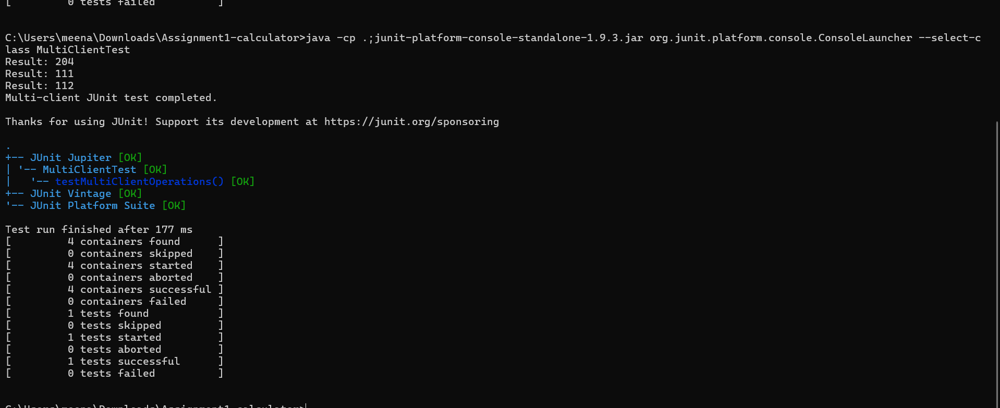

# Java RMI Calculator — Assignment 1

This project implements a Java RMI-based calculator server that maintains a **stack** and has the following remote methods:
- `void pushValue(int val)`
- `void pushOperation(String operator)` where operator ∈ {`min`, `max`, `gcd`, `lcm`}
- `int pop()`
- `boolean isEmpty()`
- `int delayPop(int millis)`

## Files
- `Calculator.java` — an RMI remote interface
- `CalculatorImplementation.java` — server-side implementation (thread-safe, shared stack)
- `CalculatorServer.java` — server bootstrap (it starts/get `rmiregistry` and binds service `CalculatorService`)
- `CalculatorClient.java` — example client
- `CalculatorTest.java` — JUnit 5 tests (single-client tests for all methods)
- `MultiClientTest.java` — multi-client concurrent test harness
- `README.md` — this file

## Compile (Linux/macOS/windows) 
I am currently using windows 
```bash
javac *.java
```

## Start RMI Registry
Start Server
```bash
rmiregistry 1099 &
```

## Run Server
```bash
java CalculatorServer
```



## Run Client (example)
```bash
java CalculatorClient

```


## Automated Testing

### JUnit 5 (single-client functional tests)
Ensure you have the JUnit Platform Console Standalone jar (e.g., `junit-platform-console-standalone-1.9.3.jar`). Then run:
```bash
javac -cp .:junit-platform-console-standalone-1.9.3.jar *.java

# run server in another terminal
java CalculatorServer

# run tests 
#windows
java -cp .;junit-platform-console-standalone-1.9.3.jar org.junit.platform.console.ConsoleLauncher --select-class CalculatorTest 
```

### Multi-client test
# windows
java -cp .;junit-platform-console-standalone-1.9.3.jar org.junit.platform.console.ConsoleLauncher --select-class MultiClientTest

